# PPT 技能合集

[English](README.md) | **简体中文**

<p align="center">
  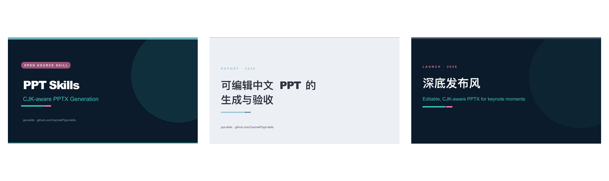
</p>

<p align="center">
  <a href="LICENSE"></a>
  <a href="https://github.com/CacinieP/ppt-skills/actions/workflows/ci.yml"></a>
  
  
  
</p>

用 PptxGenJS 生成并**验收**真实、**可编辑、适配中文排版的 PPTX** 的开源技能合集 —— 由一道确定性 QA 门禁把关，而非肉眼。

首个技能 [`themed-cn-pptx`](skills/themed-cn-pptx/) 内置两套**锁定审美 recipe**（editorial-grid、dark-launch）、provider 感知的 AI 配图层（OpenAI GPT Image 2 / Google Nano Banana Pro），以及三个 QA 工具（渲染 QA、CJK 溢出、可编辑性检查）。

---

## 🎬 演示画廊

三套锁定 demo，全部本仓库生成，**无需任何 API key**（纯色/发丝线占位回退）。下图用 LibreOffice 150 DPI 渲染。

| 演示 | 页数 | 配方 | 风格 |
| --- | --- | --- | --- |
| **Miku** | 3 | `miku`（技能展示） | 青粉撞色，明暗交替 |
| **Editorial Grid** | 6 | `recipe-editorial-grid.mjs` | Nord 中性色，发丝线报告风 |
| **Dark Launch** | 5 | `recipe-dark-launch.mjs` | 深底大字，白框二维码收尾 |

### Miku —— 技能展示

<p align="center">
  <a href="docs/img/demos/miku/miku-slide-1.jpg">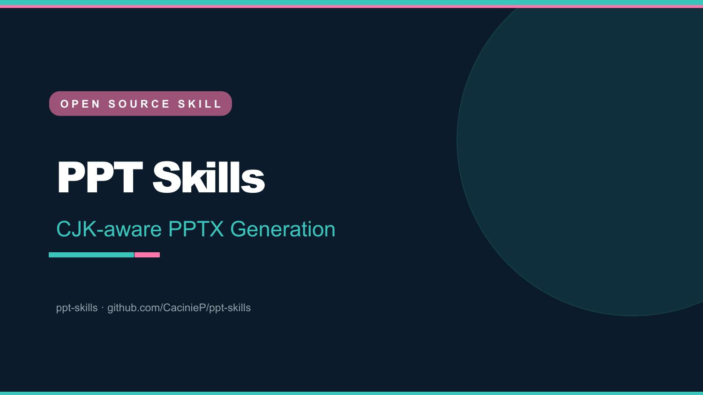</a>
  &nbsp;
  <a href="docs/img/demos/miku/miku-slide-2.jpg">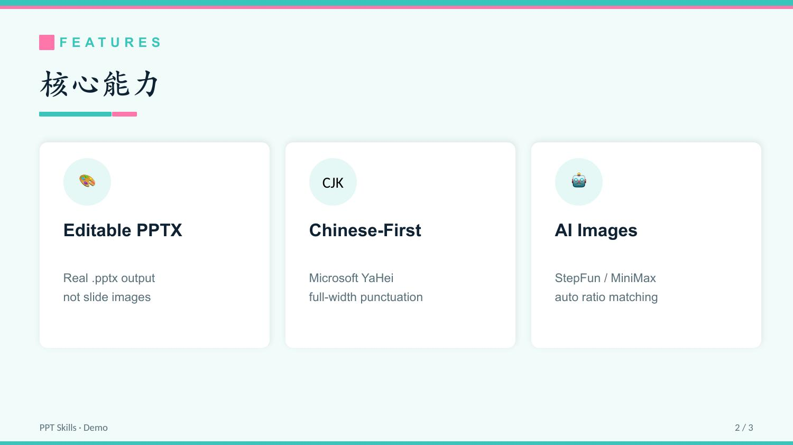</a>
  &nbsp;
  <a href="docs/img/demos/miku/miku-slide-3.jpg">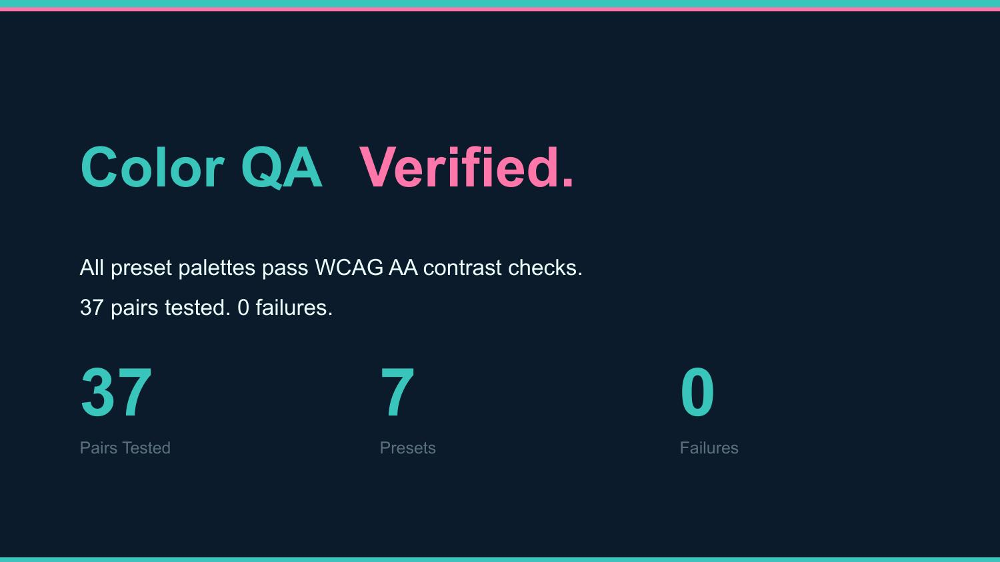</a>
</p>

### Editorial Grid —— 编辑报告风

<p align="center">
  <a href="docs/img/demos/editorial/editorial-slide-1.jpg">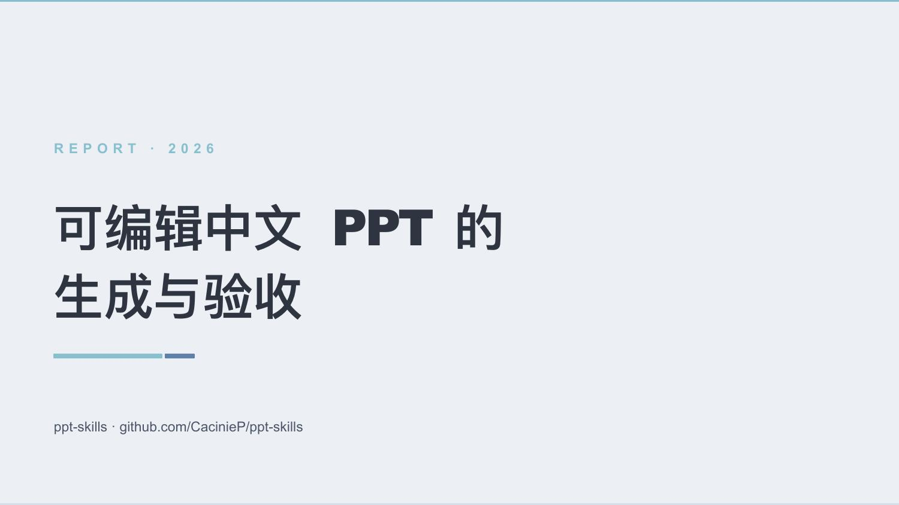</a>
  <a href="docs/img/demos/editorial/editorial-slide-2.jpg">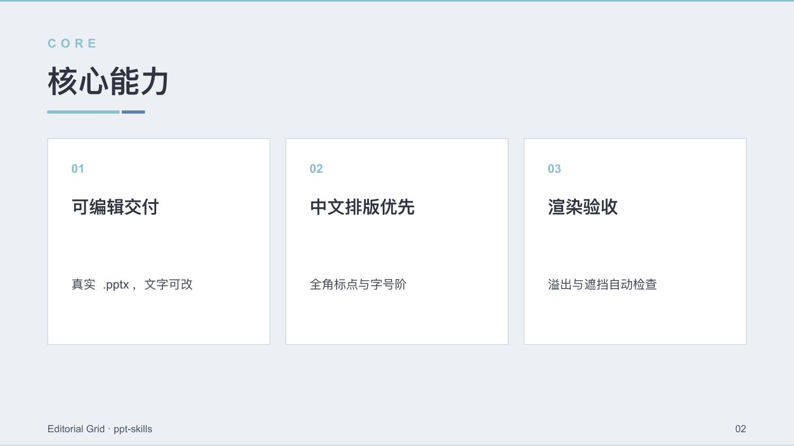</a>
  <a href="docs/img/demos/editorial/editorial-slide-3.jpg">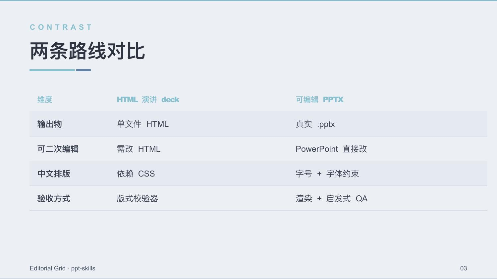</a>
  <a href="docs/img/demos/editorial/editorial-slide-4.jpg">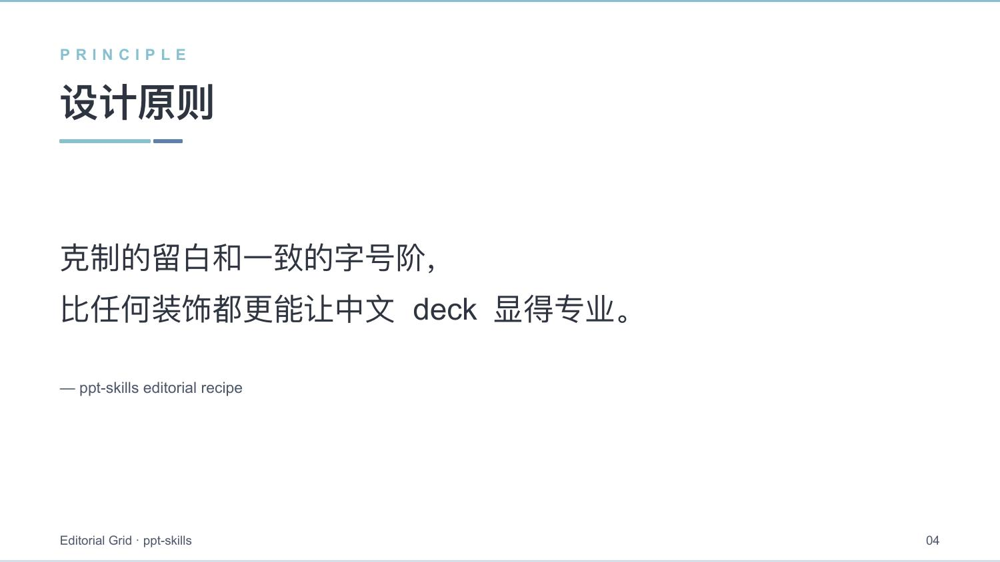</a>
  <a href="docs/img/demos/editorial/editorial-slide-5.jpg">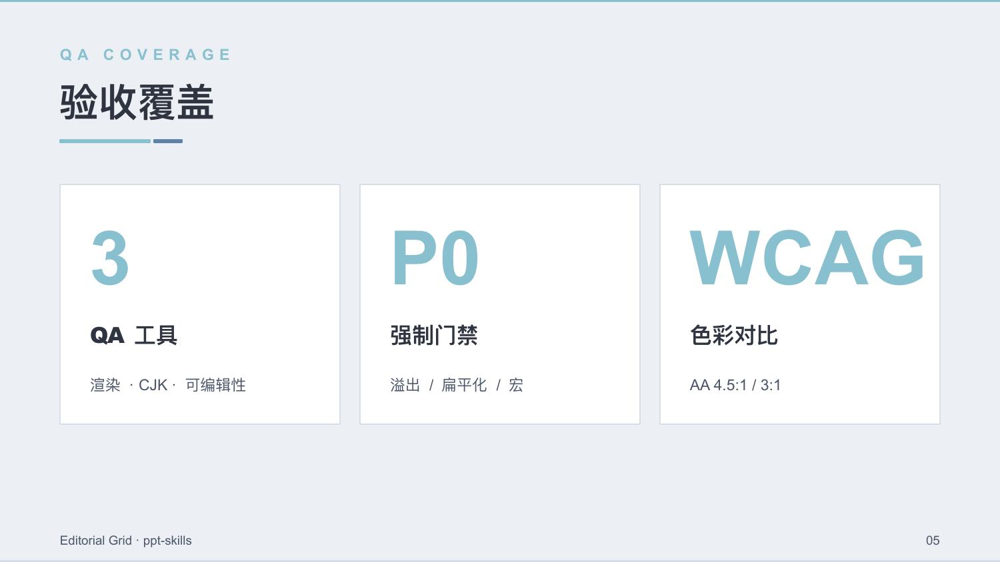</a>
  <a href="docs/img/demos/editorial/editorial-slide-6.jpg">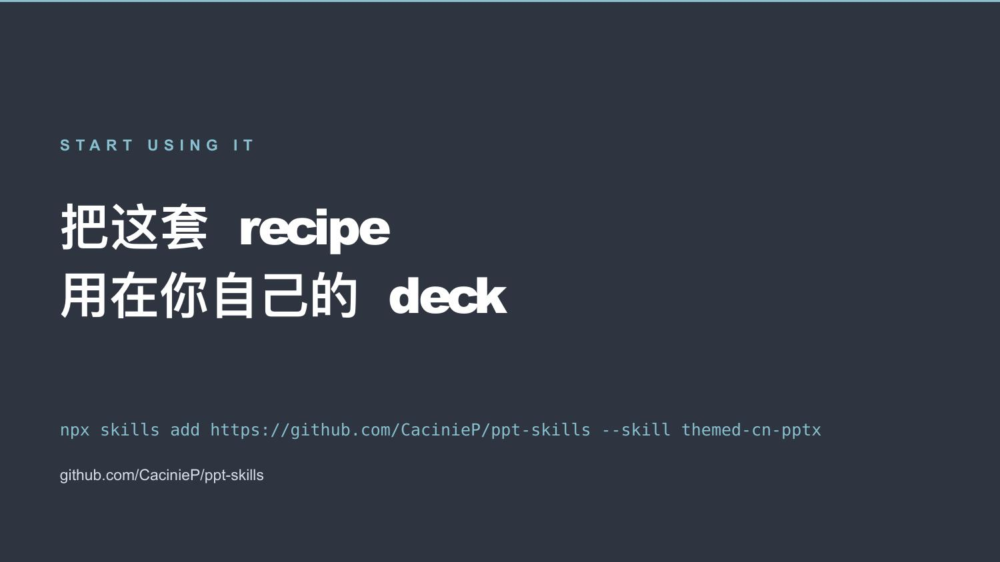</a>
</p>

### Dark Launch —— 发布收尾风

<p align="center">
  <a href="docs/img/demos/darklaunch/darklaunch-slide-1.jpg">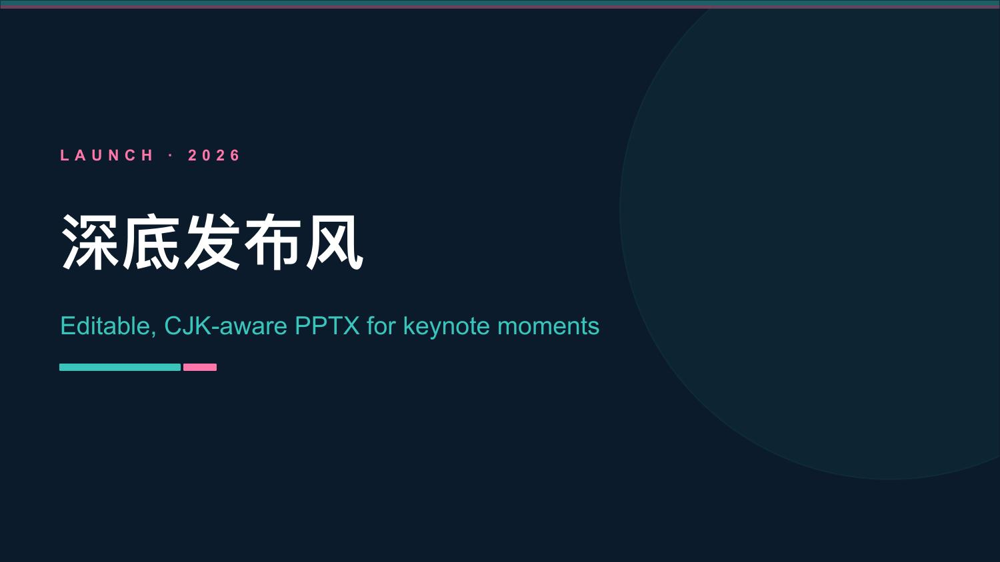</a>
  <a href="docs/img/demos/darklaunch/darklaunch-slide-2.jpg">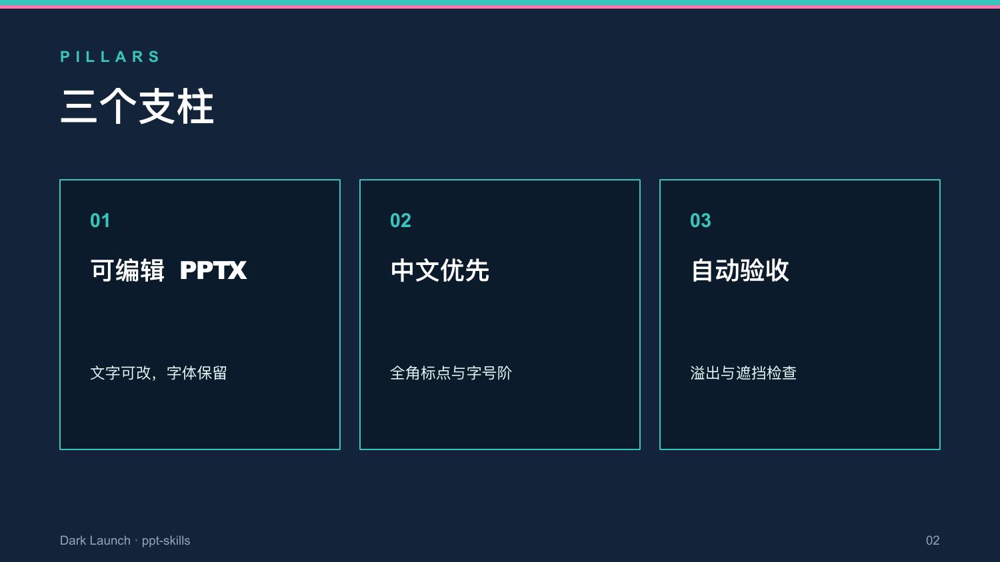</a>
  <a href="docs/img/demos/darklaunch/darklaunch-slide-3.jpg">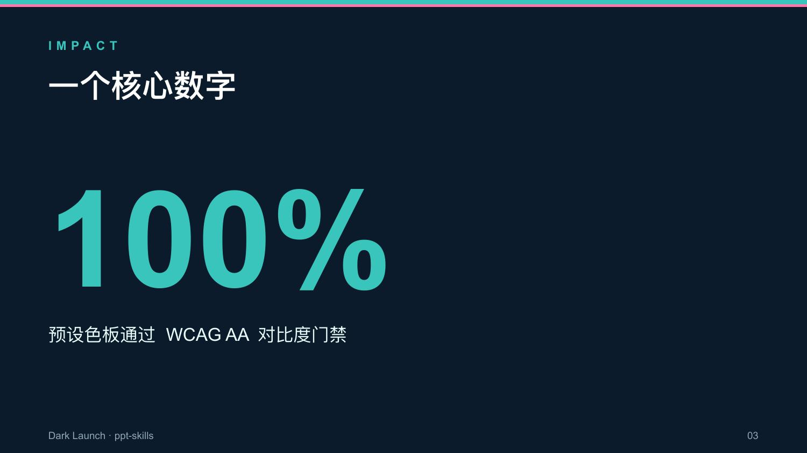</a>
  <a href="docs/img/demos/darklaunch/darklaunch-slide-4.jpg">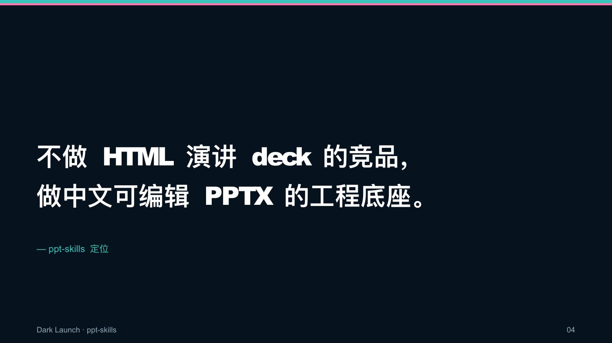</a>
  <a href="docs/img/demos/darklaunch/darklaunch-slide-5.jpg">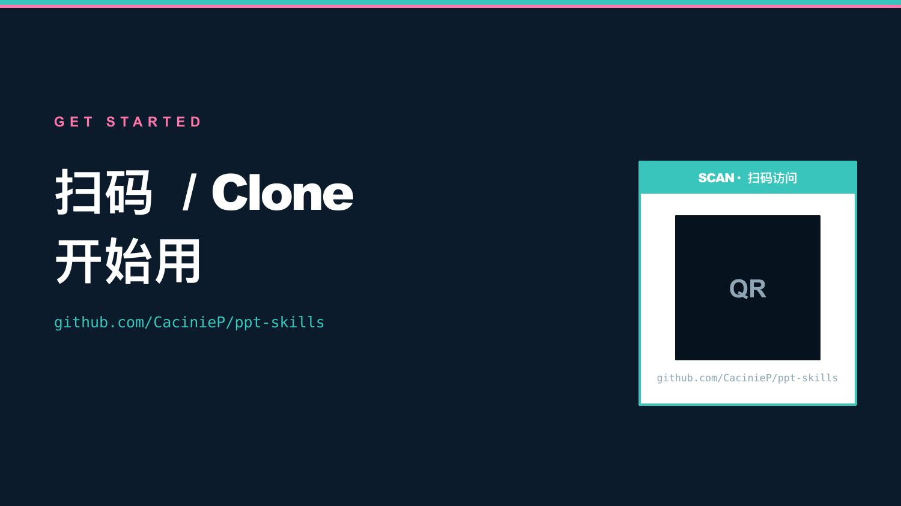</a>
</p>

> `.pptx` 源文件已提交在 `examples/slides/output/`，可直接用 PowerPoint 打开编辑。

---

## ✨ 核心亮点

- **可编辑 PPTX** —— 输出真实 `.pptx`，非整页图片；由 `pptx-editable-check.py` 验证。
- **中文排版优先** —— 字体回退、全角符号、保守字号；溢出在渲染前预测。
- **渲染 QA 门禁** —— `render-qa.mjs` 捕捉溢出、遮挡、越界、比例错误、缺页码 badge。
- **锁定配方** —— 两套锁定 recipe（editorial-grid、dark-launch），不用每次重新决定。
- **供应商感知 AI 配图** —— OpenAI GPT Image 2（推荐）/ Google Nano Banana Pro，盲测竞技场 SOTA 双选，PPT 友好尺寸预设 + 自动尺寸适配。
- **WCAG 色彩 QA** —— sRGB 亮度对比，非肉眼；CI 门禁遇 P0 即失败。
- **优雅降级** —— 没有 API key？纯色占位继续生成，绝不崩溃。

---

## 🚀 快速开始

```bash
git clone https://github.com/CacinieP/ppt-skills.git
cd ppt-skills
npm ci          # 安装锁定依赖
npm test        # skill manifest + smoke + 预置色板对比度 QA
npm run demos   # 一次构建全部三套 demo（无需 key）
```

然后把下面这段发给有 shell 权限的 Agent：

```text
帮我把这份 README 做成可编辑中文 PPTX，约 8 页，editorial-grid 配方。
```

**或直接安装技能：**

```bash
npx skills add https://github.com/CacinieP/ppt-skills --skill themed-cn-pptx
```

---

## 📋 命令

### 生成

| 命令 | 作用 |
| --- | --- |
| `npm run demo` | 3 页 **Miku** demo（无需 key） |
| `npm run demo:editorial` | 6 页 **editorial-grid** recipe demo |
| `npm run demo:darklaunch` | 5 页 **dark-launch** recipe demo |
| `npm run demos` | 一次构建全部三套 |

### QA 门禁

| 命令 | 作用 |
| --- | --- |
| `npm test` | Skill manifest **+** 导入/供应商/尺寸 **+** 预置色板对比度 QA |
| `npm run qa:render -- deck.pptx` | **PPTX 渲染 + 启发式 QA** —— 溢出、遮挡、越界、图文比例、页码 badge。P0 即退出码 1 |
| `npm run qa:render -- deck.pptx --render --out ./qa` | 上述 **+** 在装了 LibreOffice + poppler 时额外驱动 `soffice → pdf → jpg` |
| `npm run qa:cjk -- --text "标题" --font-size 44 --box-width 9` | **免渲染 CJK 溢出估算**，生成前先用 |
| `npm run qa:editable -- deck.pptx` | **可编辑性 / CJK 字体 / 宏 / 主题检查**（Python；无 python-pptx 时 zip 回退） |
| `npm run color:qa -- --palette 0F2233,F1FBFA,39C5BB,FF77AA --role body` | 调色板 WCAG 对比 |
| `npm run color:qa:presets` | 全部预置色板（CI 门禁，P0 即退出码 1） |

---

## 🛠️ 工作流

**A. 改已有 PPT** —— 读 deck / `build_*.js`，明确改动范围（颜色、页数、配图、文案、二维码、版式），编辑 + 重新生成，然后跑渲染 QA 修到干净。

**B. 从文稿生成** —— 提取源内容 → 拆成页级信息 → 定义主题 token + 配图需求 → 选可复用版式 → 生成 AI 配图、嵌入、跑渲染 QA。

---

## 🎨 AI 配图

用 [`skills/themed-cn-pptx/lib/ai-image.js`](skills/themed-cn-pptx/lib/ai-image.js)，模型为 **SOTA 双选**：OpenAI **GPT Image 2**（推荐，文生图盲测竞技场第一）和 Google **Nano Banana Pro**（`gemini-3-pro-image`）。没有 key → 返回 `null`，构建回退到占位图。

```js
import { generateSlideImage, addImageToSlide, addImageOverlay } from "./lib/ai-image.js";

const cover = await generateSlideImage({
  provider: "openai",            // 推荐；也支持 google / gpt-image / nano-banana-pro
  prompt: "青绿色科技封面背景，干净留白，留出标题区域",
  usage: "cover",                // GPT Image 2 -> 1360x768，Nano Banana Pro -> 16:9 + 2K
});

if (cover) {
  addImageToSlide(slide, cover, { x: 0, y: 0, w: 10, h: 5.625 });
  addImageOverlay(slide, pres, { color: "0B1B2B", opacity: 45 }); // 任何压字的图都需 40-55% 遮罩
}
```

### 供应商优先级

1. `generateSlideImage()` 的 `provider` 参数
2. `PPT_IMAGE_PROVIDER` / `AI_IMAGE_PROVIDER` 环境变量
3. 仅当 `GOOGLE_API_KEY` / `GEMINI_API_KEY` 存在且无 `OPENAI_API_KEY` 时选 Google
4. 默认：OpenAI GPT Image 2

### 环境变量

```bash
PPT_IMAGE_PROVIDER=openai        # openai | google    （推荐 openai）
OPENAI_API_KEY=sk-xxx
GOOGLE_API_KEY=xxx               # GEMINI_API_KEY 也可以
# 可选覆盖：
# OPENAI_BASE_URL / GOOGLE_BASE_URL / OPENAI_IMAGE_MODEL / GOOGLE_IMAGE_MODEL
```

助手在导入时自动读取 `.env`；shell/CI 变量优先级更高。`.env` 只放本地（已 gitignore），切勿提交 key。

### 尺寸映射

用途 → 尺寸/比例/版式契约与上一版（StepFun/MiniMax）完全一致，已发布 deck 的版式不受影响。

| 用途 | GPT Image 2 `size` | Nano Banana Pro 比例 + 档位 | PPTX 布局 |
| --- | --- | --- | --- |
| `cover` / `coverOverlay` | `1360x768` | `16:9` + `2K` | `10 × 5.625 in` |
| `hero` | `1360x768` | `16:9` + `2K` | `10 × 3 in` |
| `bannerWide` / `ultraWideHero` | `1344x576`（原生 21:9） | `21:9` + `2K` | `10 × 2.45 in` / `10 × 2.8 in` |
| `sideStrip` / `phoneMockup` | `768x1360` | `9:16` + `2K`/`1K` | `2.5 × 4.44 in` / `1.8 × 3.2 in` |
| `card` | `1024x1024` | `1:1` + `1K` | `2.5 × 2.5 in` |
| `cardWide` / `showcase` | `1184x896` | `4:3` + `1K`/`2K` | `3.5 × 2.65 in` / `3.9 × 2.95 in` |
| `cardTall` | `896x1184` | `3:4` + `1K` | `2.3 × 3.04 in` |
| `icon` | `1024x1024`（512x512 向上适配） | `1:1` + `1K` | `1.5 × 1.5 in` |

尺寸适配规则：`gpt-image-2` 接受任意满足约束的 `size`（两边 16 的倍数、最长边 ≤ 3840、长短边比例 ≤ 3:1、总像素 655,360–8,294,400）——SIZE_MAP 契约尺寸除 `icon`（512×512 低于最小像素数，适配为 1024×1024）和 21:9 横幅（原生 `1344x576` 生成，不再裁切 16:9）外全部直传；用户自定义尺寸经 `adaptSizeForGptImage()` 自动适配。Nano Banana Pro 传 `aspect_ratio` + `image_size`（`1K/2K/4K`，K 必须大写）；所需比例全部原生支持，不支持的比例由 `adaptAspectRatioForGemini()` 按数值最近适配。

### 端点

| 供应商 | 模型 | 默认 Base URL |
| --- | --- | --- |
| OpenAI | `gpt-image-2` | `https://api.openai.com/v1`（`/images/generations`） |
| Google | `gemini-3-pro-image` | `https://generativelanguage.googleapis.com/v1beta`（Interactions API `/interactions`） |

官方文档：[OpenAI 图片生成](https://developers.openai.com/api/docs/guides/image-generation) · [Gemini 图片生成](https://ai.google.dev/gemini-api/docs/image-generation)

---

## 🧪 QA 预期

真实交付前先渲染检查：

```bash
soffice --headless --convert-to pdf deck.pptx
pdftoppm -jpeg -r 100 deck.pdf slide
```

重点检查：中文溢出、全角符号挤压、图片上文字可读性、二维码对比度、页脚压内容、AI 配图比例是否匹配。`render-qa.mjs` 会自动跑确定性检查。

### 色彩 QA 规则

- 正文 / URL / 脚注：**≥ 4.5:1**
- 大标题 / 图标 / 边框 / UI：**≥ 3:1**
- 不用高饱和副色当正文
- 不只靠红/绿表达状态
- AI 图上放文字需 40–55% 遮罩

---

## 🧭 与 `guizang-ppt-skill` 的关系

`guizang-ppt-skill` 是成熟的**单文件 HTML 横向翻页 deck** 技能 —— 浏览器优先、强审美模板。本仓库走的是**另一条路线，不是竞品**。

| 维度 | `guizang-ppt-skill` | `ppt-skills`（本仓库） |
| --- | --- | --- |
| **输出物** | 单文件 HTML，浏览器 | 真实可编辑 `.pptx`，PowerPoint |
| **适合** | 线下分享、demo day、个人风格演讲 | 需交付 .pptx、后续可编辑、中文排版稳定的 deck |
| **审美系统** | 两套固定模板（杂志风、瑞士风） | 两套锁定 recipe + 可扩展主题系统 |
| **QA 方式** | HTML 版式校验器（`data-layout`） | PPTX 渲染 + 启发式 QA、CJK 溢出、可编辑性、色彩对比 |
| **配图** | Codex/GPT-Image 入 HTML | provider 层（GPT Image 2 / Nano Banana Pro）返回 PPTX layout 元数据 |

**两条路线，互补。** 浏览器演讲选 HTML；交付物必须是 `.pptx` 选本仓库。

---

## 📦 平台支持

| 平台 | 状态 | 说明 |
| --- | --- | --- |
| Claude Code / Codex / ZCode | ✅ 支持 | 原生 skill 工作流 |
| Cursor / 本地 Agent | ✅ 可用 | 需文件读写 + shell |
| CI（GitHub Actions） | ✅ 已测 | Node 20/22 矩阵，npm ci，smoke + 色彩 QA + demo 构建 + 渲染 QA |
| 纯聊天机器人 | ⚠️ 不推荐 | 没有文件系统 + shell，稳定 PPTX + QA 很难 |

---

## 📁 仓库结构

```text
ppt-skills/
  README.md            README.zh-CN.md      docs/                 # 渲染好的 demo 图片（已提交）
  package.json         design-principles.md
  .github/workflows/ci.yml
  examples/
    build_miku_demo.mjs  build_editorial_demo.mjs  build_darklaunch_demo.mjs
    color-qa.sample.json  color-qa.presets.json  cjk-overflow.sample.json  render-qa.sample.json
    slides/output/        # 已提交的 .pptx demo —— 用 PowerPoint 打开编辑
      miku-demo.pptx  editorial-demo.pptx  darklaunch-demo.pptx
  scripts/
    smoke-test.mjs  color-qa.mjs  color-qa-presets.mjs
    render-qa.mjs   cjk-overflow-check.mjs   pptx-editable-check.py
  skills/themed-cn-pptx/
    SKILL.md
    references/   aesthetic-rules.md  image-constraints.md  layout-slots.md
    recipes/      recipe-editorial-grid.mjs  recipe-dark-launch.mjs  design-contract*.md
    lib/          ai-image.js  stepfun-image.js  cjk-text.js  pptx-shapes.js  zip-reader.js
```

---

## 🤝 适合 / 不适合

**✅ 适合** —— 需要交付 `.pptx` / 后续在 PowerPoint 编辑 / 中文排版稳定 / 二维码收尾页 / 可验证的 CI 门禁构建。

**❌ 不适合** —— 只要浏览器演示（用 HTML deck 技能）/ 大型动态数据看板 / 永远不碰 PowerPoint 的 deck。

## 🖋️ 版权与 IP 提醒

角色/IP 主题优先使用色彩系统、抽象符号和用户授权素材。不要暗示官方背书；除非用户拥有权利或明确要求 legally-safe 的 inspired-by 方向，否则不要生成商标角色图。

## 🤝 贡献

有 PPT 技能 recipe？在下面目录提 PR：

```text
skills/<skill-name>/SKILL.md
skills/<skill-name>/lib/          # 可选工具代码
skills/<skill-name>/examples/     # 可选构建脚本
```

## 许可

[MIT](LICENSE)
